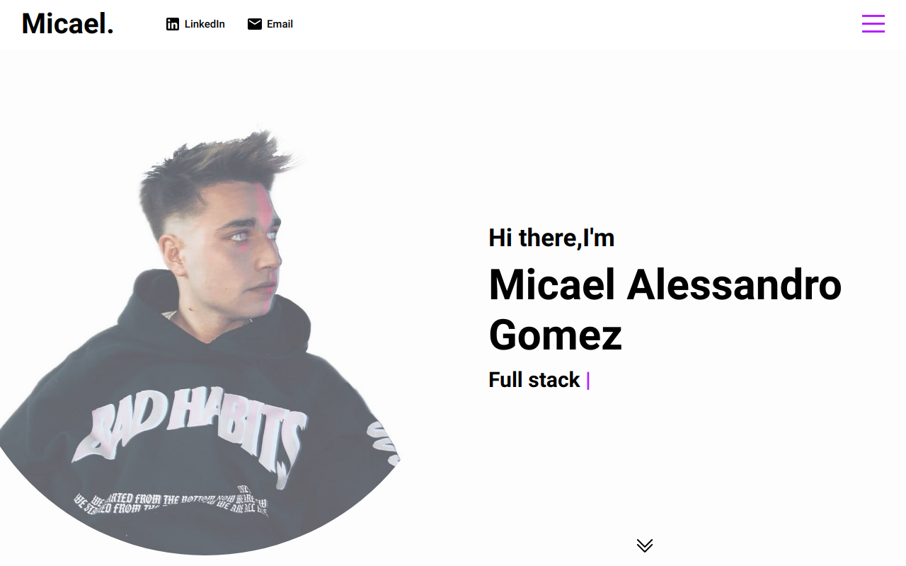

# PORTFOLIO MICAEL ALESSANDRO GOMEZ

## Purpose

**This portfolio is made with the purpose of showing my skills, my projects, to allow people to contact me and obviously because I love to develop in front end !**

  

## Built with

- Javascript.
- React.js.
- SASS.

## Available Scripts

**npm i** to install
**npm start** to lunch on your localhost

Runs the app in the development mode.\
Open [http://localhost:3000](http://localhost:3000) to view it in your browser.
